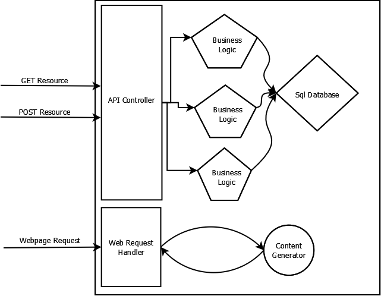
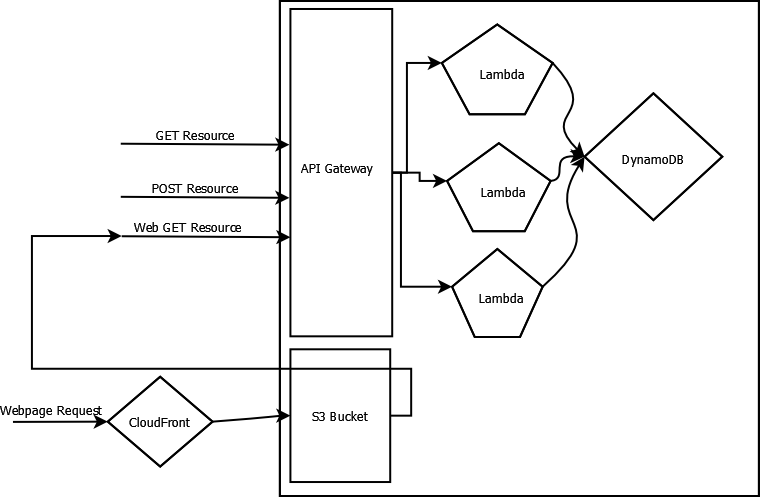
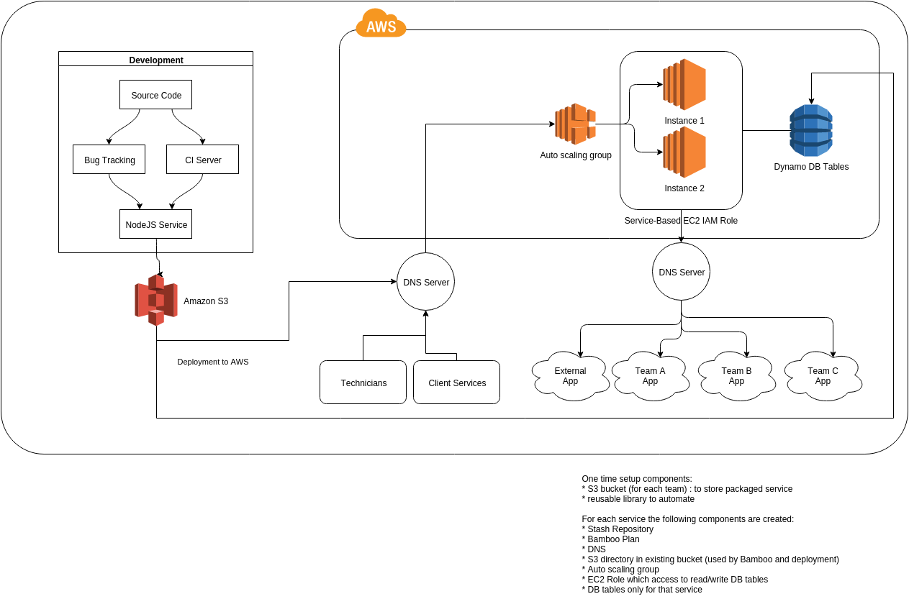

# Microservices benefit

Microservices are designed to implement business logic in a straigtforward way.  Take your business logic deploy to production.  Altough there are easier and faster methods, microservices architecture gives one additionaly benefit--scale.  Maintenance and cost of ownership of microservices are greatly reduced, and if prepared to write microservices, teams will gain unlimited benefit of delivering value in more reliable way.

### Create microservices 

* [How to use continuous integration](https://github.com/wparad/Continuous-Integration)

### Microservice architecture
Let's start by just deconstructing what a microservice looks like.  When thinking about microservices, making sure to separate concerns has a huge importance.  Following single responsibility princible or [SRP](https://en.wikipedia.org/wiki/Single_responsibility_principle), allows for each component to scale as needed.

The major components of a service include:

* Persistent data store (sql/nosql database)
* HTTP RESTful interface
* Controller (or HTTP API mapping)
* Business Logic functions (actual code)
* Authentication (user management and access control)
* Static content (admin configuration control or website data)

The infrastructure needed to manage a microservice, keeping it running include, but are not limited to:

* Load balanacer
* Fault tolerance
* Logging
* Deplomyent/Downtime
* Versioning
* Dynamic Requests
* Compatible interfaces
* Source code management
* Publishing availability
* Authorization engine (LDAP or AD)
* Servers to house code
* Continuous delivery/continuous integration system

The pieces needed to run microservices but are not part of the service itself are non-added value coding, and keeping spent time managing them at a minimum is of the highest importance.  Depending on the system that is being used, more time may be needed, the cost of training new members ont he software may go up, etc...

Using Amazon's AWS ensures elimination of high cost low value infrastructure management.

### Using AWS to create serverless microservices
When thinking about a microservice breaking down the components makes it easier to talk about:

Using AWS to emulate this is easy:

As you can see the exact same components used to make up a microservice can be exactly emulated in AWS, without altering the architcture.  The advantage of course is the integration of pieces and the support of infrastrucutre is free*.

* [API Gateway](https://aws.amazon.com/api-gateway/) - Rounting HTTP Requests
* [Lambda Functions](https://aws.amazon.com/lambda/) - Business Logic functions
* [S3 Buckets](https://aws.amazon.com/s3/) - Stores static content distributed through a CDN ([CloudFrount](https://aws.amazon.com/cloudfront/))
* [DynamoDB](https://aws.amazon.com/dynamodb/) - Database & persistent data store
* [CloudWatch](https://aws.amazon.com/cloudwatch/) - Logging
* [Cognito](https://aws.amazon.com/cognito/) - Map users to tokens for authorization.

#### AWS Alternatives
AWS offers other services which could be used to support microservices, such as EC2 and ELB.  However, using these does not extinguish the responsibilities of managing servers, which is what we really want to avoid here.  We want to build server-less microservices.  In the case of using one of these architectures the best approach would be to at the very least implement:

`*AWS is not free, you are trading support of infrastructure for money.  This is an argument for cloud technology, which is not discussed here.`